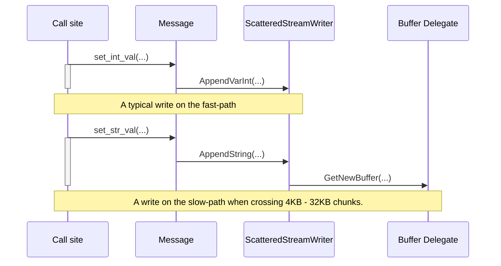

# ProtoZero

ProtoZero is a zero-copy zero-alloc zero-syscall protobuf serialization libary
purposefully built for Perfetto's tracing use cases.

## Motivations

ProtoZero has been designed and optimized for proto serialization, which is used
by all Perfetto tracing paths.
Deserialization was introduced only at a later stage of the project and is
mainly used by offline tools
(e.g., [TraceProcessor](/docs/analysis/trace-processor.md).
The _zero-copy zero-alloc zero-syscall_ statement applies only to the
serialization code.

Perfetto makes extensive use of protobuf in tracing fast-paths. Every trace
event in Perfetto is a proto
(see [TracePacket](/docs/reference/trace-packet-proto.autogen) reference). This
allows events to be strongly typed and makes it easier for the team to maintain
backwards compatibility using a language that is understood across the board.

Tracing fast-paths need to have very little overhead, because instrumentation
points are sprinkled all over the codebase of projects like Android
and Chrome and are performance-critical.

Overhead here is not just defined as CPU time (or instructions retired) it
takes to execute the instrumentation point. A big source of overhead in a
tracing system is represented by the working set of the instrumentation points,
specifically extra I-cache and D-cache misses which would slow down the
non-tracing code _after_ the tracing instrumentation point.

The major design departures of ProtoZero from canonical C++ protobuf libraries
like [libprotobuf](https://github.com/google/protobuf) are:

* Treating serialization and deserialization as different use-cases served by
  different code.

* Optimizing for binary size and working-set-size on the serialization paths.

* Ignoring most of the error checking and long-tail features of protobuf
  (repeated vs optional, full type checks).

* ProtoZero is not designed as general-purpose protobuf de/serialization and is
  heavily customized to maintain the tracing writing code minimal and allow the
  compiler to see through the architectural layers.

* Code generated by ProtoZero needs to be hermetic. When building the
  amalgamated [Tracing SDK](/docs/instrumentation/tracing-sdk.md), the all
  perfetto tracing sources need to not have any dependency on any other
  libraries other than the C++ standard library and C library.

## Usage

At the build-system level, ProtoZero is extremely similar to the conventional
libprotobuf libray.
The ProtoZero `.proto -> .pbzero.{cc,h}` compiler is based on top of the
libprotobuf parser and compiler infrastructure. ProtoZero is as a `protoc`
compiler plugin.

ProtoZero has a build-time-only dependency on libprotobuf (the plugin depends
on libprotobuf's parser and compiler). The `.pbzero.{cc,h}` code generated by
it, however, has no runtime dependency (not even header-only dependencies) on
libprotobuf.

In order to generate ProtoZero stubs from proto you need to:

1. Build the ProtoZero compiler plugin, which lives in
   [src/protozero/protoc_plugin/](/src/protozero/protoc_plugin/).
   ```bash
   tools/ninja -C out/default protozero_plugin protoc
   ```

2. Invoke the libprotobuf `protoc` compiler passing the `protozero_plugin`:
   ```bash
  out/default/protoc \
      --plugin=protoc-gen-plugin=out/default/protozero_plugin \
      --plugin_out=wrapper_namespace=pbzero:/tmp/  \
      test_msg.proto
   ```
   This generates `/tmp/test_msg.pbzero.{cc,h}`.
   
   NOTE: The .cc file is always empty. ProtoZero-generated code is header only.
   The .cc file is emitted only because some build systems' rules assume that
   protobuf codegens generate both a .cc and a .h file.

## Proto serialization

The quickest way to undestand ProtoZero design principles is to start from a
small example and compare the generated code between libprotobuf and ProtoZero.

```protobuf
syntax = "proto2";

message TestMsg {
  optional string str_val = 1;
  optional int32 int_val = 2;
  repeated TestMsg nested = 3;
}
```

#### libpprotobuf approach

The libprotobuf approach is to generate a C++ class that has one member for each
proto field, with dedicated serialization and de-serialization methods.

```bash
out/default/protoc  --cpp_out=. test_msg.proto
```

generates test_msg.pb.{cc,h}. With many degrees of simplification, it looks
as follows:

```c++
// This class is generated by the standard protoc compiler in the .pb.h source.
class TestMsg : public protobuf::MessageLite {
  private:
   int32 int_val_;
   ArenaStringPtr str_val_;
   RepeatedPtrField<TestMsg> nested_;  // Effectively a vector<TestMsg>

 public:
  const std::string& str_val() const;
  void set_str_val(const std::string& value);

  bool has_int_val() const;
  int32_t int_val() const;
  void set_int_val(int32_t value);

  ::TestMsg* add_nested();
  ::TestMsg* mutable_nested(int index);
  const TestMsg& nested(int index);

  std::string SerializeAsString();
  bool ParseFromString(const std::string&);
}
```

The main characteristic of these stubs are:

* Code generated from .proto messages can be used in the codebase as general
  puropse objects, without ever using the `SerializeAs*()` or `ParseFrom*()`
  methods (although anecdotal evidence suggests that most project use these
  proto-generated classes only at the de/serialization endpoints).

* The end-to-end journey of serializing a proto involves two steps:
  1. Setting the individual int / string / vector fields of the generated class.
  2. Doing a serialization pass over these fields.

  In turn this has side-effects on the code generated. STL copy/assingment
  operators for strings and vectors are non-trivial because, for instance, they
  need to deal with dynamic memory resizing.

#### ProtoZero approach

```c++
// This class is generated by the ProtoZero plugin in the .pbzero.h source.
class TestMsg : public protozero::Message {
 public:
  void set_str_val(const std::string& value) {
    AppendBytes(/*field_id=*/1, value.data(), value.size());
  }
  void set_str_val(const char* data, size_t size) {
    AppendBytes(/*field_id=*/1, data, size);
  }
  void set_int_val(int32_t value) {
    AppendVarInt(/*field_id=*/2, value);
  }
  TestMsg* add_nested() {
    return BeginNestedMessage<TestMsg>(/*field_id=*/3);
  }
}
```

The ProtoZero-generated stubs are append-only. As the `set_*`, `add_*` methods
are invoked, the passed arguments are directly serialized into the target
buffer. This introduces some limitations:

* Readback is not possible: these classes cannot be used as C++ struct
  replacements.

* No error-checking is performed: nothing prevents a non-repeated field to be
  emitted twice in the serialized proto if the caller accidentally calls a
  `set_*()` method twice. Basic type checks are still performed at compile-time
  though.

* Nested fields must be filled in a stack fashion and cannot be written
  interleaved. Once a nested message is started, its fields must be set before
  going back setting the fields of the parent message. This turns out to not be
  a problem for most tracing use-cases.

This has a number of advantages:

* The classes generated by ProtoZero don't add any extra state on top of the
  base class they derive (`protozero::Message`). They define only inline
  setter methods that call base-class serialization methods. Compilers can
  see through all the inline expansions of these methods.

* As a consequence of that, the binary cost of ProtoZero is independent of the
  number of protobuf messages defined and their fields, and depends only on the
  number of `set_*`/`add_*` calls. This (i.e. binary cost of non-used proto
  messages and fields) anecdotally has been a big issue with libprotobuf.

* The serialization methods don't involve any copy or dynamic allocation. The
  inline expansion calls directly into the corresponding `AppendVarInt()` /
  `AppendString()` methods of `protozero::Message`.

* This allows to directly serialize trace events into the
  [tracing shared memory buffers](/docs/concepts/buffers.md), even if they are
  not contiguous.

### Scattered buffer writing

A key part of the ProtoZero design is supporting direct serialization on
non-globally-contiguous sequences of contiguous memory regions.

This happens by decoupling `protozero::Message`, the base class for all the
generated classes, from the `protozero::ScatteredStreamWriter`.
The problem it solves is the following: ProtoZero is based on direct
serialization into shared memory buffers chunks. These chunks are 4KB - 32KB in
most cases. At the same time, there is no limit in how much data the caller will
try to write into an individual message, a trace event can be up to 256 MiB big.


#### Fast-path

At all times the underlying `ScatteredStreamWriter` knows what are the bounds
of the current buffer. All write operations are bound checked and hit a
slow-path when crossing the buffer boundary.

Most write operations can be completed within the current buffer boundaries.
In that case, the cost of a `set_*` operation is in essence a `memcpy()` with
the extra overhead of var-int encoding for protobuf preambles and
length-delimited fields.

#### Slow-path

When crossing the boundary, the slow-path asks the
`ScatteredStreamWriter::Delegate` for a new buffer. The implementation of
`GetNewBuffer()` is up to the client. In tracing use-cases, that call will
acquire a new thread-local chunk from the tracing shared memory buffer.

Other heap-based implementations are possible. For instance, the ProtoZero
sources provide a helper class `HeapBuffered<TestMsg>`, mainly used in tests (see
[scattered_heap_buffer.h](/include/perfetto/protozero/scattered_heap_buffer.h)),
which allocates a new heap buffer when crossing the boundaries of the current
one.

Consider the following example:

```c++
TestMsg outer_msg;
for (int i = 0; i < 1000; i++) {
  TestMsg* nested = outer_msg.add_nested();
  nested->set_int_val(42);
}
```

At some point one of the `set_int_val()` calls will hit the slow-path and
acquire a new buffer. The overall idea is having a serialization mechanism
that is extremely lightweight most of the times and that requires some extra
function calls when buffer boundary, so that their cost gets amortized across
all trace events.

In the context of the overall Perfetto tracing use case, the slow-path involves
grabbing a process-local mutex and finding the next free chunk in the shared
memory buffer. Hence writes are lock-free as long as they happen within the
thread-local chunk and require a critical section to acquire a new chunk once
every 4KB-32KB (depending on the trace configuration).

The assumption is that the likeliness that two threads will cross the chunk
boundary and call `GetNewBuffer()` at the same time is extremely slow and hence
the critical section is un-contended most of the times.



### Deferred patching

Nested messages in the protobuf binary encoding are prefixed with their
varint-encoded size.

Consider the following:

```c++
TestMsg* nested = outer_msg.add_nested();
nested->set_int_val(42);
nested->set_str_val("foo");
```

The canonical encoding of this protobuf message, using libprotobuf, would be:

```bash
1a 07 0a 03 66 6f 6f 10 2a
^-+-^ ^-----+------^ ^-+-^
  |         |          |
  |         |          +--> Field ID: 2 [int_val], value = 42.
  |         |
  |         +------> Field ID: 1 [str_val], len = 3, value = "foo" (66 6f 6f).
  |
  +------> Field ID: 3 [nested], lenght: 7  # !!!
```

The second byte in this sequence (07) is problematic for direct encoding. At the
point where `outer_msg.add_nested()` is called, we can't possibly know upfront
what the overall size of the nested message will be (in this case, 5 + 2 = 7).

The way we get around this in ProtoZero is by reserving four bytes for the
_size_ of each nested message and back-filling them once the message is
finalized (or when we try to set a field in one of the parent messages).
We do this by encoding the size of the message using redundant varint encoding,
in this case: `87 80 80 00` instead of `07`.

At the C++ level, the `protozero::Message` class holds a pointer to its `size`
field, which typically points to the beginning of the message, where the four
bytes are reserved, and back-fills it in the `Message::Finalize()` pass.

This works fine for cases where the entire message lies in one contiguous buffer
but opens a further challenge: a message can be several MBs big. Looking at this
from the overall tracing perspective, the shared memory buffer chunk that holds
the beginning of a message can be long gone (i.e. committed in the central
service buffer) by the time we get to the end.

In order to support this use case, at the tracing code level (outside of
ProtoZero), when a message crosses the buffer boundary, its `size` field gets
redirected to a temporary patch buffer
(see [patch_list.h](/src/tracing/core/patch_list.h)). This patch buffer is then
sent out-of-band, piggybacking over the next commit IPC (see
[Tracing Protocol ABI](/docs/design-docs/api-and-abi.md#tracing-protocol-abi))
